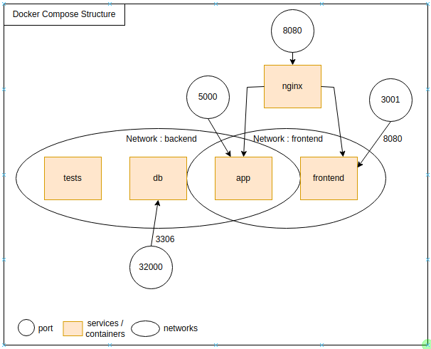
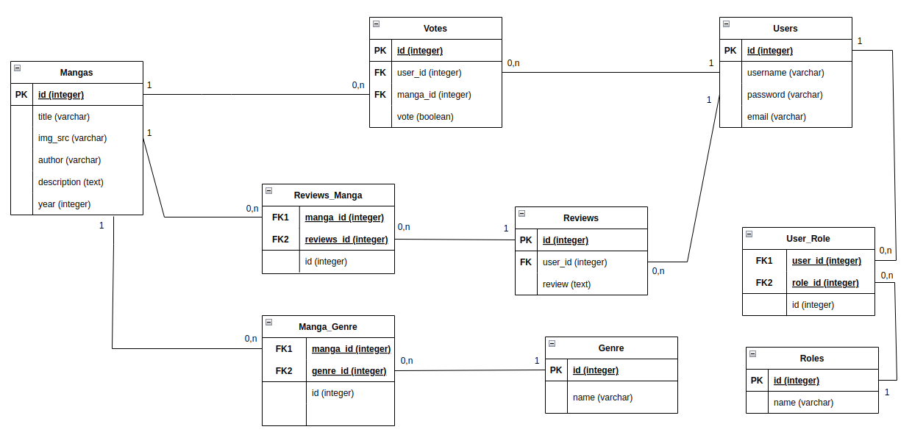

# Structure du projet

```
.
├── app
│   ├── app.py
│   ├── Dockerfile
│   ├── __pycache__
│   ├── requirements.txt
│   ├── static
│   ├── templates
│   └── tests
├── db
│   └── init.sql
├── docker-compose.yml
├── frontend
│   ├── babel.config.js
│   ├── dist
│   ├── Dockerfile
│   ├── jsconfig.json
│   ├── node_modules
│   ├── package.json
│   ├── package-lock.json
│   ├── public
│   ├── README.md
│   ├── src
│   └── vue.config.js
├── nginx
│   ├── app.conf
│   └── Dockerfile
└── README.md

```


# Lancer le projet 
###  Se mettre à la racine du projet : où se trouve le fichier docker-compose.yml
  Build le projet : docker-compose build  
  Lancer le projet : docker-compose up 

# Lancer MySQL

  docker exec -it projet-docker_db_1 bash  
  mysql -uroot -proot

# Diagramme composant de l'application


# Schéma Docker services & ports



# Modèle de Base de données  



# docker-compose up : Résultats Terminal

```
└─$ docker-compose up   
Starting projet-docker_db_1 ... done
Recreating projet-docker_app_1   ... done
Recreating projet-docker_tests_1 ... done
Recreating projet-docker_frontend_1 ... done
Attaching to projet-docker_db_1, projet-docker_tests_1, projet-docker_app_1, projet-docker_frontend_1
app_1       |  * Serving Flask app 'app'
app_1       |  * Debug mode: off
app_1       | WARNING: This is a development server. Do not use it in a production deployment. Use a production WSGI server instead.
app_1       |  * Running on all addresses (0.0.0.0)
app_1       |  * Running on http://127.0.0.1:5000
app_1       |  * Running on http://172.20.0.4:5000
app_1       | Press CTRL+C to quit
db_1        | 2022-10-09 20:30:19+00:00 [Note] [Entrypoint]: Entrypoint script for MySQL Server 5.7.39-1.el7 started.
db_1        | 2022-10-09 20:30:20+00:00 [Note] [Entrypoint]: Switching to dedicated user 'mysql'
db_1        | 2022-10-09 20:30:20+00:00 [Note] [Entrypoint]: Entrypoint script for MySQL Server 5.7.39-1.el7 started.
db_1        | '/var/lib/mysql/mysql.sock' -> '/var/run/mysqld/mysqld.sock'
db_1        | 2022-10-09T20:30:21.615490Z 0 [Warning] TIMESTAMP with implicit DEFAULT value is deprecated. Please use --explicit_defaults_for_timestamp server option (see documentation for more details).
db_1        | 2022-10-09T20:30:21.623343Z 0 [Note] mysqld (mysqld 5.7.39) starting as process 1 ...
db_1        | 2022-10-09T20:30:21.667077Z 0 [Note] InnoDB: PUNCH HOLE support available
db_1        | 2022-10-09T20:30:21.667169Z 0 [Note] InnoDB: Mutexes and rw_locks use GCC atomic builtins
db_1        | 2022-10-09T20:30:21.667176Z 0 [Note] InnoDB: Uses event mutexes
db_1        | 2022-10-09T20:30:21.667178Z 0 [Note] InnoDB: GCC builtin __atomic_thread_fence() is used for memory barrier
db_1        | 2022-10-09T20:30:21.667180Z 0 [Note] InnoDB: Compressed tables use zlib 1.2.12
db_1        | 2022-10-09T20:30:21.667181Z 0 [Note] InnoDB: Using Linux native AIO
db_1        | 2022-10-09T20:30:21.682600Z 0 [Note] InnoDB: Number of pools: 1
db_1        | 2022-10-09T20:30:21.690006Z 0 [Note] InnoDB: Using CPU crc32 instructions
db_1        | 2022-10-09T20:30:21.695997Z 0 [Note] InnoDB: Initializing buffer pool, total size = 128M, instances = 1, chunk size = 128M
db_1        | 2022-10-09T20:30:21.718644Z 0 [Note] InnoDB: Completed initialization of buffer pool
db_1        | 2022-10-09T20:30:21.728207Z 0 [Note] InnoDB: If the mysqld execution user is authorized, page cleaner thread priority can be changed. See the man page of setpriority().
db_1        | 2022-10-09T20:30:21.784892Z 0 [Note] InnoDB: Highest supported file format is Barracuda.
db_1        | 2022-10-09T20:30:21.911466Z 0 [Note] InnoDB: Creating shared tablespace for temporary tables
db_1        | 2022-10-09T20:30:21.911543Z 0 [Note] InnoDB: Setting file './ibtmp1' size to 12 MB. Physically writing the file full; Please wait ...
db_1        | 2022-10-09T20:30:21.975350Z 0 [Note] InnoDB: File './ibtmp1' size is now 12 MB.
db_1        | 2022-10-09T20:30:21.976213Z 0 [Note] InnoDB: 96 redo rollback segment(s) found. 96 redo rollback segment(s) are active.
db_1        | 2022-10-09T20:30:21.976223Z 0 [Note] InnoDB: 32 non-redo rollback segment(s) are active.
db_1        | 2022-10-09T20:30:21.978366Z 0 [Note] InnoDB: Waiting for purge to start
db_1        | 2022-10-09T20:30:22.029662Z 0 [Note] InnoDB: 5.7.39 started; log sequence number 12240641
db_1        | 2022-10-09T20:30:22.030409Z 0 [Note] Plugin 'FEDERATED' is disabled.
db_1        | 2022-10-09T20:30:22.031118Z 0 [Note] InnoDB: Loading buffer pool(s) from /var/lib/mysql/ib_buffer_pool
db_1        | 2022-10-09T20:30:22.093539Z 0 [Note] Found ca.pem, server-cert.pem and server-key.pem in data directory. Trying to enable SSL support using them.
db_1        | 2022-10-09T20:30:22.093563Z 0 [Note] Skipping generation of SSL certificates as certificate files are present in data directory.
db_1        | 2022-10-09T20:30:22.093566Z 0 [Warning] A deprecated TLS version TLSv1 is enabled. Please use TLSv1.2 or higher.
db_1        | 2022-10-09T20:30:22.093567Z 0 [Warning] A deprecated TLS version TLSv1.1 is enabled. Please use TLSv1.2 or higher.
db_1        | 2022-10-09T20:30:22.097742Z 0 [Warning] CA certificate ca.pem is self signed.
db_1        | 2022-10-09T20:30:22.097924Z 0 [Note] Skipping generation of RSA key pair as key files are present in data directory.
db_1        | 2022-10-09T20:30:22.100402Z 0 [Note] Server hostname (bind-address): '*'; port: 3306
db_1        | 2022-10-09T20:30:22.102147Z 0 [Note] IPv6 is available.
db_1        | 2022-10-09T20:30:22.102395Z 0 [Note]   - '::' resolves to '::';
db_1        | 2022-10-09T20:30:22.102477Z 0 [Note] Server socket created on IP: '::'.
db_1        | 2022-10-09T20:30:22.121258Z 0 [Warning] Insecure configuration for --pid-file: Location '/var/run/mysqld' in the path is accessible to all OS users. Consider choosing a different directory.
db_1        | 2022-10-09T20:30:22.181973Z 0 [Note] InnoDB: Buffer pool(s) load completed at 221009 20:30:22
db_1        | 2022-10-09T20:30:22.269602Z 0 [Note] Event Scheduler: Loaded 0 events
db_1        | 2022-10-09T20:30:22.270060Z 0 [Note] mysqld: ready for connections.
db_1        | Version: '5.7.39'  socket: '/var/run/mysqld/mysqld.sock'  port: 3306  MySQL Community Server (GPL)
tests_1     | ============================= test session starts ==============================
tests_1     | platform linux -- Python 3.9.14, pytest-7.1.3, pluggy-1.0.0
tests_1     | rootdir: /app
tests_1     | collected 6 items
tests_1     | 
tests_1     | app/tests/test.py ......                                                 [100%]
tests_1     | 
tests_1     | ============================== 6 passed in 0.32s ===============================
projet-docker_tests_1 exited with code 0
frontend_1  |                                                                                                                                                                                                                                
frontend_1  | > frontend@0.1.0 serve
frontend_1  | > vue-cli-service serve
frontend_1  | 
frontend_1  |  INFO  Starting development server...
 DONE  Compiled successfully in 20035ms8:30:52 PM
frontend_1  | 

frontend_1  |   App running at:
frontend_1  |   - Local:   http://localhost:8080/ 
frontend_1  |   - Network: http://172.21.0.3:8080/
frontend_1  | 
frontend_1  |   Note that the development build is not optimized.
frontend_1  |   To create a production build, run npm run build.
frontend_1  | 
 WAIT  Compiling...8:30:53 PM
frontend_1  | 
frontend_1  | Compiling...
 DONE  Compiled successfully in 542ms8:30:53 PM
frontend_1  | 

frontend_1  |   App running at:
frontend_1  |   - Local:   http://localhost:8080/ 
frontend_1  |   - Network: http://172.21.0.3:8080/
frontend_1  | 
Build finished at 20:30:53 by 0.000s


```

# Test Backend + BDD

Les tests se trouvent dans le fichier test.py. Des tests de requêtes GET et un test de la connexion sur la base de données sont effectués. Vous pouvez qu'ils passent sur l'extrait du terminal ci-dessus.

# Docker Health Check Test

```
48e68be20a93   projet-docker_frontend   "docker-entrypoint.s…"   45 seconds ago   Up 43 seconds (health: starting)   0.0.0.0:3001->8080/tcp, :::3001->8080/tcp                projet-docker_frontend_1
ccc3ebce7296   projet-docker_app        "/bin/sh -c 'python …"   46 seconds ago   Up 44 seconds (health: starting)   0.0.0.0:5000->5000/tcp, :::5000->5000/tcp                projet-docker_app_1
c1fc66182018   mysql:5.7                "docker-entrypoint.s…"   48 seconds ago   Up 46 seconds (health: starting)   33060/tcp, 0.0.0.0:32000->3306/tcp, :::32000->3306/tcp   projet-docker_db_1

```

# docker-projet_app push sur docker hub

https://hub.docker.com/r/roberto8/projet-docker_app